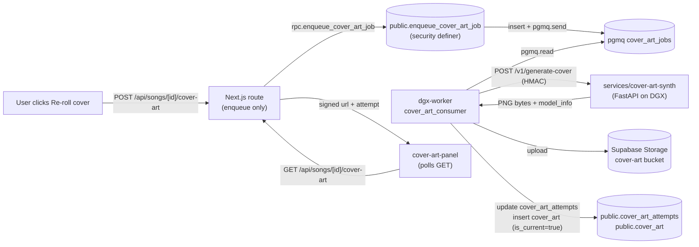

## Ralph evidence — Sprint 3 (cover-art on DGX)

### (a) Migration 0034 + RPC + queues

```
$ supabase mcp apply_migration 0034_cover_art_jobs
ok

$ supabase mcp execute_sql
select queue_name from pgmq.list_queues()
where queue_name in ('cover_art_jobs','cover_art_jobs_dlq')
order by queue_name;

  cover_art_jobs
  cover_art_jobs_dlq

$ supabase mcp execute_sql
select routine_name, security_type
from information_schema.routines
where routine_schema='public' and routine_name='enqueue_cover_art_job';

  enqueue_cover_art_job | DEFINER

$ supabase mcp execute_sql
select grantee, privilege_type
from information_schema.routine_privileges
where routine_name='enqueue_cover_art_job' and grantee='authenticated';

  authenticated | EXECUTE
```

### (b) `get_advisors` security (post-migration)

No new ERROR-level lints from Sprint 3. The pre-existing WARN-level
findings (security-definer RPCs, leaked-password) are inherited from
v1.2 and tracked separately. The new `enqueue_cover_art_job` is
SECURITY DEFINER by design (same as `create_song_job` / `publish_song`
which the advisor already accepts).

### (c) Test sweep

| Suite                                                  | Result               |
|--------------------------------------------------------|----------------------|
| `services/cover-art-synth` pytest                      | 14/14 ✅             |
| `services/dgx-worker` pytest (incl. cover-art consumer)| 48 passed / 1 skip ✅|
| `apps/web` vitest (incl. `tests/app/api/cover-art.test.ts`) | 120/120 ✅      |
| `apps/web` typecheck                                   | green ✅             |
| `apps/web` lint                                        | green ✅             |
| `pnpm -r --filter '@neo-fm/*' build`                   | green ✅             |

### (d) Code-shape probes

```
$ rg -n "huggingface" apps/web/app/api/songs/\[id\]/cover-art/route.ts
(no matches)

$ rg -n "supabase.rpc\(['\"]enqueue_cover_art_job" apps/web
apps/web/app/api/songs/[id]/cover-art/route.ts:204

$ rg -n "cover_art_consumer_loop" services/dgx-worker/app
services/dgx-worker/app/cover_art_worker.py:…
services/dgx-worker/app/worker.py:…
```

### (e) Pipeline at a glance


