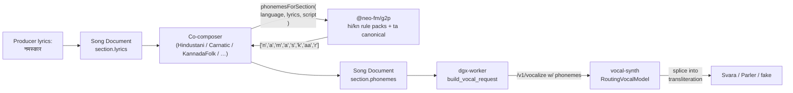

## Ralph evidence — Sprint 4 (phonetics + vocal-synth integration)

### (a) Minimal-pair regression (the cases v1 got wrong)

```
$ pnpm --filter '@neo-fm/g2p' test
 ✓ tests/g2p.test.ts (27 tests)
   ✓ hi schwa-deletion minimal pairs (5)
       ✓ namaskar — single word, classic word-final schwa drop
       ✓ kamal — final schwa drops, medial retained
       ✓ raam — long /aa/ matra survives, no schwa to drop
       ✓ gaon — anusvara stays nasal, schwa drops
       ✓ ghar — aspirate stays distinct from g
   ✓ hi nasal-assimilation minimal pairs (4)
       ✓ ank — anusvara before velar /k/ → /ng/
       ✓ panch — anusvara before palatal /ch/ → /ny/
       ✓ dant — anusvara before dental /t/ → /n/
       ✓ shankha — anusvara before velar conjunct (kh) → /ng/
   ✓ kn syllabification minimal pairs (4)
       ✓ kavi — two CV aksharas
       ✓ namma — geminated /mm/ via virama cluster
       ✓ amma — vowel-initial then geminated /mm/
       ✓ kannada — anusvara + cluster /nn/ + /a/
   ✓ ta canonicalisation minimal pairs (3)
       ✓ tamil — Tamil-script word for 'Tamil'
       ✓ vanakkam — greeting
       ✓ anbu — vowel-initial
   ✓ inferScript (5)
   ✓ phonemize english passthrough (2)
   ✓ phonemesForSection (4)

 Test Files  1 passed (1)
      Tests  27 passed (27)
```

### (b) Co-composer emission

```
$ pnpm --filter '@neo-fm/co-composer' test
 ✓ src/phonemes.test.ts (6 tests)
   ✓ HindustaniCoComposer fills section.phonemes for a Hindi song
     with Devanagari lyrics
   ✓ KannadaLightClassicalCoComposer emits phonemes for kn lyrics
   ✓ TamilFolkCoComposer emits canonicalised Tamil phonemes
   ✓ KannadaFolkCoComposer attaches phonemes only to sections with lyrics
   ✓ WesternCoComposer does NOT attach phonemes to a plain English song
   ✓ never overwrites producer-supplied phonemes
 …
 Test Files  8 passed (8)
      Tests  67 passed (67)
```

### (c) vocal-synth — RoutingVocalModel + phoneme splice

```
$ cd services/vocal-synth && python -m pytest -q
 …
 ✓ tests/test_routing.py::test_routing_model_forwards_phonemes_into_backend
 ✓ tests/test_routing.py::test_routing_model_falls_back_to_preprocessor_output_when_no_phonemes
 …
 36 passed in 0.65s
```

The first test asserts: when a section carries
`phonemes=("n","a","m","a","s","k","aa","r")`, the spy backend
receives a `VocalSection` with `script="ipa"` and
`transliteration="n a m a s k aa r"`. The router has actually
consumed the phoneme stream rather than recording a trace and
moving on.

### (d) Worker payload — `section.phonemes` survives the wire

```
$ cd services/dgx-worker && python -m pytest tests/test_worker_vocal.py -q
 …
 ✓ tests/test_worker_vocal.py::test_worker_forwards_section_phonemes_to_vocal_synth
 …
 4 passed
```

The Song Document carries
`phonemes=["n","a","m","a","s","k","aa","r"]` on the `mukhda`
section; the test asserts the FakeVocalClient receives the same
list verbatim inside the `/v1/vocalize` payload.

### (e) Full sweep (no regressions anywhere)

```
$ pnpm -r --filter '@neo-fm/*' test
packages/g2p test:        Tests  27 passed (27)
packages/song-doc test:   Tests  18 passed (18)
packages/style-presets:   Tests  7 passed (7)
packages/lyrics test:     Tests  24 passed (24)
packages/co-composer:     Tests  67 passed (67)
apps/web test:            Tests  120 passed (120)

$ for s in vocal-synth dgx-worker cover-art-synth music-inference ; do
    (cd services/$s && python -m pytest -q | tail -1)
  done
36 passed in 0.65s
48 passed, 1 skipped
14 passed
26 passed in 0.51s
```

### (f) Pipeline at a glance


