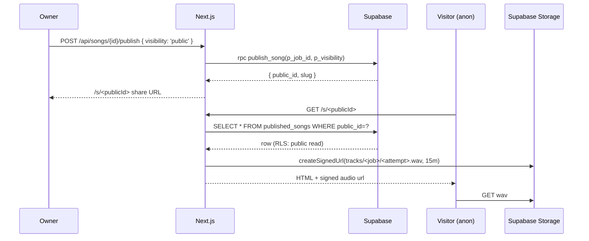
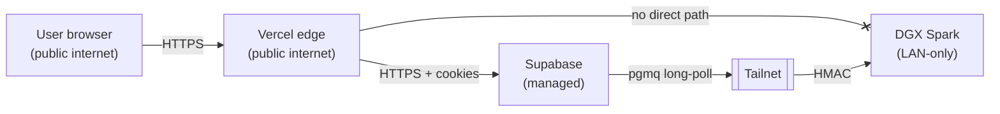

# neo-fm Architecture

> Stable reference doc. Source of truth for "what runs where, who
> talks to whom, what state lives in each layer". Critique of the
> same system lives in `docs/REVIEWS/architecture.md`. Per-decision
> rationale lives under `docs/DECISIONS/`.

Last revised: v1.1 deep-dive (Sprint J).

## 1. One-line system summary

neo-fm is an India-first composition-aware music generation product.
A browser app on Vercel takes a structured **Song Document** from the
user, hands it to **Supabase Postgres** (which doubles as the job
queue via pgmq), and a self-hosted **NVIDIA DGX Spark** worker pulls
jobs, calls a local **HeartMuLa-OSS-3B** music model and a
multi-backend **vocal-synth** stack, mixes the result, and writes a
signed-URL-playable WAV back to **Supabase Storage**. Realtime
streams the status back to the browser.

## 2. Top-level diagram

```mermaid
flowchart LR
  subgraph cloud[Cloud (Vercel + Supabase managed)]
    direction LR
    web["apps/web<br/>Next.js 14 App Router<br/>edge middleware<br/>RSC + Server Actions"]
    sbAuth["Supabase Auth<br/>(@supabase/ssr)"]
    sbDb[("Supabase Postgres 17<br/>RLS + pgmq queue<br/>postgres_changes")]
    sbStor["Supabase Storage<br/>tracks/ + stems/ + cover-art/"]
    sbRT["Supabase Realtime"]
    edge["Supabase Edge Functions<br/>orphan-reconciler<br/>notify-job-complete"]
  end

  subgraph dgx[DGX Spark on-prem (Tailscale only)]
    direction TB
    worker["dgx-worker<br/>Python + uv<br/>cooperative pre-emption"]
    music["music-inference<br/>HeartMuLa-OSS-3B"]
    vocal["vocal-synth<br/>RoutingVocalModel<br/>(svara | parler | fake)"]
    mixer["mixer.py<br/>side-chain + stereo bounce"]
    govFile[("governor.state<br/>/var/lib/neo-fm")]
    govCli["scripts/neo-fm-governor.py"]
  end

  subgraph obs[Observability]
    prom["Prometheus<br/>monitoring profile"]
    grafana["Grafana<br/>neo-fm-overview"]
  end

  user(["User browser"]) -->|HTTPS + cookies| web
  web -->|REST + RPC| sbDb
  web -->|cookie sessions| sbAuth
  web -->|signed URLs| sbStor
  web -->|postgres_changes ws| sbRT

  sbDb -.->|"create_song_job<br/>create_section_regen_job"| sbDb
  sbDb -.-> edge

  worker -->|"pgmq read (lease)"| sbDb
  worker -->|HMAC POST| music
  worker -->|HMAC POST| vocal
  worker --> mixer
  worker -->|PUT WAV / PUT stem| sbStor
  worker -->|UPDATE jobs / INSERT tracks| sbDb
  worker -.-> govFile
  govCli -.-> govFile

  music & vocal & worker -.->|"/metrics"| prom
  prom --> grafana
```

Key invariants the diagram is enforcing:

- The browser **never** talks to the DGX directly. The DGX is on a
  Tailscale tailnet, not on the public internet.
- The DGX **never** holds a Supabase service-role secret in its
  long-lived environment; it authenticates as a dedicated
  `neo_fm_worker` Postgres role with `BYPASSRLS` and pgmq grants
  (ADR 0004).
- Storage writes from the worker are owner-checked indirectly via
  the worker's path convention (`tracks/<job_id>/<attempt>.wav`);
  signed-URL reads are minted by the web app, never by the worker.

## 3. Component inventory

| Layer | Component | Repo path | Owner | Notes |
| --- | --- | --- | --- | --- |
| Web | Marketing surface | `apps/web/app/(marketing)/*` | web | India-first landing, /discover, /pricing, /help, /feedback |
| Web | App shell | `apps/web/app/(app)/*` | web | Auth-gated; library, songs/[id], account, onboarding/handle |
| Web | Public song surface | `apps/web/app/s/[publicId]`, `apps/web/app/embed/[publicId]` | web | OG card + embed iframe (ADR 0013) |
| Web | API routes | `apps/web/app/api/**` | web | All HMAC/RLS-checked; rate-limited in middleware |
| Web | Middleware | `apps/web/middleware.ts` | web | Session refresh + per-IP rate limit + security headers |
| DB | Migrations | `infra/supabase/migrations/*.sql` | infra | Sequentially numbered, applied via Supabase MCP |
| DB | Edge functions | `infra/supabase/functions/*` | infra | orphan-reconciler, notify-job-complete |
| Worker | dgx-worker | `services/dgx-worker` | dgx | uv + asyncio. Pulls from pgmq, calls inference + vocal, mixes, persists. |
| Inference | music-inference | `services/music-inference` | dgx | FastAPI shim over HeartMuLa-OSS-3B with HMAC + governor signal. |
| Inference | vocal-synth | `services/vocal-synth` | dgx | RoutingVocalModel: kenpath/svara-tts-v1, ai4bharat/indic-parler-tts, FakeVocalModel for tests. Preprocessing (NFC, ZWJ/ZWNJ, halant, IPA, prosody) + evaluation harness (librosa). |
| Observability | Prometheus + Grafana | `infra/observability/*` | dgx | Scrapes all three Python services + governor proxy. |
| Tools | Codegen | `tools/codegen` | platform | OpenAPI 3.1 + Zod from Song Document schema. |

## 4. Data plane

### 4.1 Song lifecycle (create)

```mermaid
sequenceDiagram
  autonumber
  participant U as User browser
  participant W as Next.js (Vercel)
  participant SB as Supabase Postgres
  participant Q as pgmq.q_song_jobs
  participant D as dgx-worker
  participant M as music-inference
  participant V as vocal-synth
  participant Mix as mixer.py
  participant S as Supabase Storage
  participant RT as Supabase Realtime

  U->>W: POST /api/songs (Song Document)
  W->>SB: rpc create_song_job(p_song_document, ...)
  SB->>Q: pgmq.send(payload)
  SB-->>W: { job_id, song_document_id, status: 'queued' }
  W-->>U: 201 -> redirect /library
  loop while jobs.status in (queued, processing)
    D->>Q: read 1 message (lease = 60s)
    Q-->>D: payload + msg_id
    D->>SB: CAS attempts++ status=processing
    D->>M: POST /v1/generate (HMAC)
    M-->>D: instrumental.wav (mono)
    par per primary language
      D->>V: POST /v1/vocalize (HMAC)
      V-->>D: vocal_<lang>.wav
    end
    D->>Mix: align + side-chain duck + stereo bounce
    D->>S: PUT tracks/{job_id}/{attempt_id}.wav
    opt stems enabled
      D->>S: PUT stems/{job_id}/{kind}.wav
      D->>SB: INSERT track_stems
    end
    D->>SB: INSERT tracks ; UPDATE jobs SET status=completed
    D->>Q: pgmq.archive(msg_id)
  end
  SB-->>RT: postgres_changes on jobs
  RT-->>U: row update (Realtime channel)
  U->>W: GET /api/songs/{id}/audio-url
  W->>S: createSignedUrl(...) (15 min TTL)
  W-->>U: { url }
  U->>S: GET wav (range)
```

### 4.2 Failure + recovery

- **Worker crash mid-job**: pgmq lease times out (60 s) and the
  message reappears. The worker uses `attempts` + a CAS on
  `(status, attempts)` to detect double-dispatch and skip work that
  another worker has completed.
- **Worker writes WAV but dies before UPDATE**: orphan recovery
  paths kick in. `recover_song_job(p_job_id)` (caller-owned) and
  `reconciler_recover_job(p_job_id)` (service role only, called by
  the `orphan-reconciler` edge function on a 5-minute cron) detect
  `tracks` rows whose parent `jobs.status` is not `completed` and
  re-queue the message via `pgmq.send` (ADR 0009 + Sprint C
  recovery). The web UI surfaces a `Recover` button when a job has
  been stuck in `processing` for more than 10 minutes.
- **Vocal-synth backend fails**: `RoutingVocalModel` falls back
  one tier (svara -> parler -> fake) and records the chosen backend
  in `tracks.vocal_backend` so the eval dashboard can spot
  systematic regressions.

### 4.3 Publish + embed



Embed iframe (`/embed/<publicId>`) gets a relaxed CSP
(`frame-ancestors *`) so creators can drop it anywhere. The rest of
the app is `frame-ancestors 'self'` + `X-Frame-Options: DENY`.

## 5. State map

| State | Where it lives | Lifetime |
| --- | --- | --- |
| Song Document (canonical) | `public.song_documents` (JSONB) | Forever (FK from jobs) |
| Job status / attempts | `public.jobs` | Forever |
| Generated audio | `tracks/` bucket + `public.tracks` | 30 days for free tier (ADR 0005), forever for Creator+ |
| Stems | `stems/` bucket + `public.track_stems` | Same retention envelope as parent track |
| Cover art | `cover-art/` bucket + `public.cover_art` | Same as job |
| Public profiles | `public.users.handle` + `public_profiles` view | Until handle changes |
| Likes / follows / reports | `public.song_likes`, `public.follows`, `public.song_reports` | Forever |
| Feedback | `public.feedback` | Forever (operator-readable only) |
| Waitlist | `public.waitlist` | Forever |
| Queue messages | `pgmq.q_song_jobs` + `pgmq.q_song_jobs_archive` | Archive: ~14 days |
| Governor state | `/var/lib/neo-fm/governor.state` (bind-mounted) | Until host reboots |

## 6. Trust boundaries



- **User -> Vercel**: only Supabase Auth cookies cross this line.
  All routes go through the middleware which enforces rate limits
  and security headers.
- **Vercel -> Supabase**: server-side calls use a service-role
  client (sb_secret_*) only for tightly scoped operations
  (waitlist read, account delete). User-side calls use the SSR
  client with the user's JWT.
- **Vercel -> DGX**: there is no path. The worker pulls from
  Supabase; nothing in Vercel calls the DGX.
- **DGX -> Supabase**: a single `neo_fm_worker` role; pgmq read /
  archive, tracks INSERT, jobs UPDATE, storage PUT for tracks/ and
  stems/. No SELECT outside the queue and a few CAS-friendly views.
- **DGX internal**: services authenticate to each other with HMAC
  on a shared `NEO_FM_INTERNAL_HMAC_SECRET`.

## 7. Where to find the code

- Schemas: `packages/song-schemas` (Zod -> TS) + `infra/supabase/migrations`.
- Web routes: `apps/web/app/(marketing|app)/**` and `apps/web/app/api/**`.
- Worker entrypoint: `services/dgx-worker/app/main.py`.
- Music inference: `services/music-inference/app/main.py`.
- Vocal synth + routing + eval: `services/vocal-synth/app/{main,routing,preprocess,eval}.py`.
- Observability: `infra/observability/{prometheus,grafana}` + ADR 0017.
- Governor: `services/dgx-worker/app/governor.py` + `scripts/neo-fm-governor.py` + ADR 0011/0016.
- ADRs: `docs/DECISIONS/`. New decisions in this sprint:
  - 0019 app shell + auth lifecycle
  - 0020 vocal-synth multi-backend + eval
  - 0021 security-definer review
