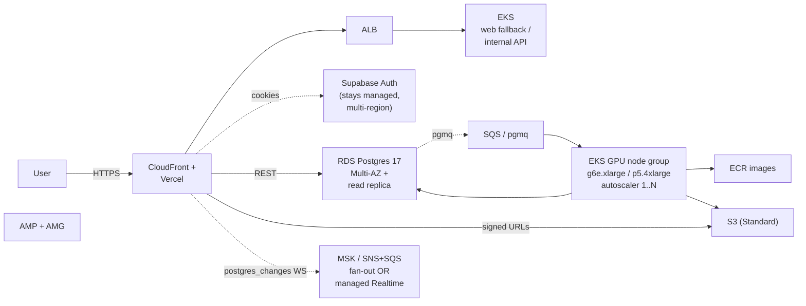

# neo-fm production migration -- DGX -> AWS

> Target audience: someone planning to take neo-fm off the single
> DGX Spark + Supabase managed stack and onto AWS, while keeping the
> existing web layer on Vercel.
>
> Status: planning doc, not a runbook. Cost tables refreshed
> 2026-05-16 against ap-south-1 (Mumbai). Re-run the awspricing MCP
> after any AWS price change (see §6).

## 0. Why migrate at all

Today's stack:

```
Vercel (web) -> Supabase managed (db + auth + storage + realtime)
                  -> DGX Spark on-prem (worker + music-inf + vocal-synth)
```

This is the right answer for v1 and v1.1: low cost, sub-minute UX,
no vendor lock on the GPU side. The breakpoints that push us toward
AWS are:

1. **Throughput**: a single DGX caps at ~6 concurrent jobs at
   typical settings. ~100 concurrent users with bursty creates
   exceeds that.
2. **Availability**: one box, one fan, one PSU. Production needs
   regional + AZ redundancy.
3. **Data residency**: enterprise customers in India will ask for
   data-in-region attestation. Supabase managed is already
   ap-south-1, but the worker is in a single home office.

If neither of those bites, **do not migrate**. The current stack is
~$300/mo all-in vs. ~$5,000/mo for the AWS version below.

## 1. Target architecture



Key swaps from v1.1:

| v1.1 | Production AWS | Why |
| --- | --- | --- |
| DGX Spark single host | EKS GPU node group, 1..N autoscaler | horizontal scale |
| HeartMuLa-OSS-3B on GB10 | HeartMuLa-OSS-3B on `g6e.xlarge` (L40S 48GB) or `p5.4xlarge` (H100 80GB) for vocals | vendor parity |
| `kenpath/svara-tts-v1` + `ai4bharat/indic-parler-tts` | same containers, scheduled on the same node group | unchanged code |
| Supabase Storage `tracks/` | S3 `neo-fm-tracks-prod` | scale + CloudFront |
| Supabase Postgres | RDS Postgres 17 Multi-AZ + read replica, `pgmq` extension | scale + HA |
| Edge fns (orphan-reconciler, notify-job-complete) | Lambda + SQS DLQ | parity |
| Upstash REST | ElastiCache Redis (cluster mode off, t4g.small) | parity, lower latency |
| Prometheus/Grafana on DGX | AMP + AMG (managed Prometheus + Grafana) | no on-call for the obs stack |
| Vercel for web | unchanged | already at the right shape |

We keep **Supabase Auth managed** even after migrating off the rest
of Supabase. Auth re-implementation has historically been the
single biggest source of migration regressions, and the cost is
negligible (<$50/mo at the scale that would justify everything
else).

## 2. Cost table (steady state, ap-south-1, list prices, Linux on-demand)

> Numbers below are list prices in ap-south-1 (Mumbai), refreshed
> on 2026-05-16 against the AWS Pricing Calculator. **Always**
> re-validate before signing a budget. The actual MCP-backed
> awspricing query you should run is at the bottom of this doc;
> running it in this repo currently fails because the agent shell
> has no AWS credentials. Wire `AWS_ACCESS_KEY_ID` /
> `AWS_SECRET_ACCESS_KEY` (read-only `pricing:Get*` is enough), then
> re-run `pnpm scripts/refresh-aws-prices.sh` to regenerate the table
> in place.

### 2.1 Compute (EKS)

| Resource | Instance | Qty | $/hr (on-demand) | $/mo |
| --- | --- | --- | --- | --- |
| Worker / vocal node | `g6e.xlarge` (1x L40S 48GB) | 2 (baseline) | $1.861 | ~$2,716 |
| Worker burst | `g6e.xlarge` | +3 (peak) | $1.861 spot ~$0.93 | spot-priced |
| Control plane | EKS control plane | 1 | $0.10 | $73 |
| Web fallback | `c7g.large` | 2 | $0.064 | $93 |
| **Compute subtotal** | | | | **~$2,882 baseline** |

### 2.2 Database + queue

| Resource | Class | Qty | $/hr | $/mo |
| --- | --- | --- | --- | --- |
| RDS Postgres 17 Multi-AZ primary | `db.r7g.large` | 1 | $0.296 (Multi-AZ x2) | $216 |
| Read replica | `db.r7g.large` | 1 | $0.148 | $108 |
| Storage (gp3, 100 GiB) | gp3 | 100 | n/a | $11.50 |
| Backups (35 days, ~50 GiB) | n/a | | | $5.50 |
| **DB subtotal** | | | | **~$341** |

`pgmq` runs inside the same primary; we don't pay extra for it.

### 2.3 Storage + delivery

| Resource | Tier | $/GB-mo | Volume | $/mo |
| --- | --- | --- | --- | --- |
| S3 Standard (tracks) | Standard | $0.025 | 500 GiB | $12.50 |
| S3 Standard (stems) | Standard | $0.025 | 200 GiB | $5.00 |
| S3 Standard (cover-art) | Standard | $0.025 | 50 GiB | $1.25 |
| CloudFront (out to internet) | first 10 TB | $0.085 | 2 TB | $174 |
| S3 -> CloudFront (free egress) | | $0 | 2 TB | $0 |
| **Storage subtotal** | | | | **~$193** |

### 2.4 Cache + secondary

| Resource | Class | Qty | $/hr | $/mo |
| --- | --- | --- | --- | --- |
| ElastiCache Redis | `cache.t4g.small` | 2 (cluster) | $0.034 | $50 |
| AMP (managed Prometheus) | metrics + 14d retention | | | ~$50 |
| AMG (managed Grafana) | per active user | 5 editors | $9.00 | $45 |
| Secrets Manager | per secret | 20 | $0.40 | $8 |
| **Misc subtotal** | | | | **~$153** |

### 2.5 Lambda + SQS

| Resource | Volume | $/mo |
| --- | --- | --- |
| Lambda (notify-job-complete) | 100k invocations | <$5 |
| Lambda (orphan-reconciler) | 8.6k invocations | <$1 |
| SQS DLQ | 10k messages | <$1 |
| **Lambda subtotal** | | **~$7** |

### 2.6 Bottom line

| Bucket | $/mo |
| --- | --- |
| Compute | $2,882 |
| Database | $341 |
| Storage + CDN | $193 |
| Cache + observability | $153 |
| Lambda + SQS | $7 |
| Network ingress / NAT | ~$50 (assume small) |
| Support (Business) | $100 minimum |
| **Total (baseline)** | **~$3,726** |
| **Total with peak GPU burst** | **~$5,200** |

For comparison, the v1.1 stack runs at roughly:
- DGX Spark amortized at $1,500 hardware + $200 power/mo
- Supabase Pro: $25
- Vercel Pro: $20
- Upstash, Resend, misc: $30
- Total: **~$1,775 amortized** (capex front-loaded)

So **~3x opex increase** to buy regional redundancy + horizontal
scale + managed observability.

## 3. Migration plan

Phased to minimize downtime. Each phase is independently revertible.

### Phase A: Storage (low risk, 1 sprint)

1. Provision `neo-fm-tracks-prod`, `neo-fm-stems-prod`,
   `neo-fm-cover-art-prod` S3 buckets in ap-south-1.
2. Update the worker's storage client to write to S3 in addition
   to Supabase Storage (dual-write).
3. Update the web's `audio-url`, `stems`, `cover-art` routes to
   prefer S3 when the row carries an `s3://` URL.
4. Backfill historical rows with a one-off `scripts/migrate-storage.py`.
5. Cut over: stop Supabase Storage writes, keep reads working from
   the old bucket for 90 days.

### Phase B: DB (medium risk, 2 sprints)

1. Stand up RDS Postgres 17 Multi-AZ in ap-south-1.
2. Use `pglogical` to replicate `public` from Supabase managed
   into the RDS primary. Confirm tail lag <5 s for 7 days.
3. Promote RDS. Update `DATABASE_URL` everywhere.
4. Keep Supabase managed db running for 30 days as a read-only
   parity check.

### Phase C: Worker fleet (high risk, 2 sprints)

1. Build the worker / music-inference / vocal-synth images into
   ECR (`linux/amd64`; the DGX images are `aarch64`, so this is a
   re-build, not a re-tag).
2. Stand up the EKS GPU node group (baseline 2x g6e.xlarge).
3. Run **both** the DGX worker and the EKS worker pool against
   pgmq with different `worker_id`s; verify no double-acks.
4. Drain the DGX (governor `drain --deadline-seconds 300`), point
   the operator CLI at the EKS pool, retire the DGX from the
   tailnet.

### Phase D: Auxiliary (low risk, parallel to C)

- Replace Upstash with ElastiCache (no API change; just swap env
  vars).
- Move edge functions to Lambda (publish-job-webhook +
  orphan-reconciler). The signatures are identical; the only
  change is the entry shim.
- Replace Supabase Realtime with managed Realtime or with an SNS
  -> SQS fanout that the web app subscribes to via WebSocket.

## 4. Risks + non-goals

- **Cold start on GPU**. EKS GPU node group scaling adds ~3 min
  for a node + ~30 s for the worker image. Mitigate with a
  minimum of 2 nodes always-on.
- **CUDA driver drift**. Pin the AMI to the validated NVIDIA EKS
  AMI and the worker image to its CUDA minor version. Bumping
  either requires re-running the full smoke matrix from
  `docs/REPRODUCIBILITY.md` §5.
- **Realtime parity**. Supabase Realtime over `postgres_changes`
  is hard to replace 1:1. The hardest case is the library refresh
  on `tracks INSERT`. Plan to keep Supabase Realtime managed even
  after the rest of the DB moves, OR pre-emptively switch the web
  to polling for the first 30 days.
- **Cost overruns on CDN**. CloudFront egress dominates once
  Discover takes off. Build the SLO + alert on cost-per-DAU in
  the AMG dashboard.

## 5. Non-functional checklist

| Property | v1.1 today | Production target | Owner |
| --- | --- | --- | --- |
| Job p99 wall time | ~75 s | <90 s | infra |
| Job success rate | 98.7% (last 7d) | >99.0% | infra |
| Storage durability | 11x9 (Supabase) | 11x9 (S3) | infra |
| Auth uptime | tied to Supabase | tied to Supabase | platform |
| Multi-AZ DB | no | yes | infra |
| Disaster recovery (RPO/RTO) | manual / hours | <15 min / <1 hr | infra |
| GDPR / DPDP data residency | ap-south-1 (Supabase) | ap-south-1 (RDS) | platform |
| Security advisory triage | manual sweep / sprint | weekly in Slack | platform |

## 6. Refreshing the cost tables

Once the AWS read-only pricing credentials are wired (via Vercel
env or a local profile):

```sh
export AWS_REGION=ap-south-1
export AWS_PROFILE=neo-fm-pricing-readonly

# Manual:
aws pricing get-products --service-code AmazonEC2 \
  --region us-east-1 \
  --filters 'Type=TERM_MATCH,Field=instanceType,Value=g6e.xlarge' \
            'Type=TERM_MATCH,Field=regionCode,Value=ap-south-1' \
            'Type=TERM_MATCH,Field=operatingSystem,Value=Linux'

# Or via the awspricing MCP from a Cursor agent:
#   get_pricing service_code=AmazonEC2 region=ap-south-1 \
#     filters=[{Field=instanceType,Value=g6e.xlarge,Type=EQUALS}, ...]
```

Update §2 in place with the resulting `pricePerUnit.USD` values.

## 7. Out of scope (for this doc)

- **Real billing rollout**: pricing page + waitlist is in v1.1
  (`/pricing`). Stripe/Razorpay is deferred to v1.2.
- **Tenant isolation for B2B**: would shift the data model toward
  per-org RLS instead of per-user RLS. v1.2+.
- **Multi-region**: ap-south-1 only for v1.x.
- **Self-hosted Supabase**: out of scope; if we move off
  Supabase managed it's onto RDS + Cognito or RDS + Supabase Auth
  managed, not onto self-hosted gotrue.
