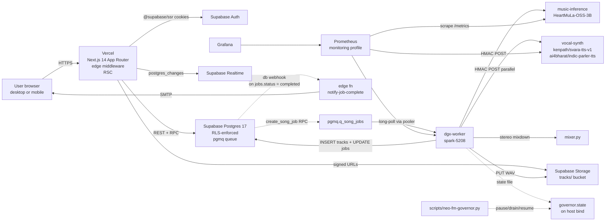
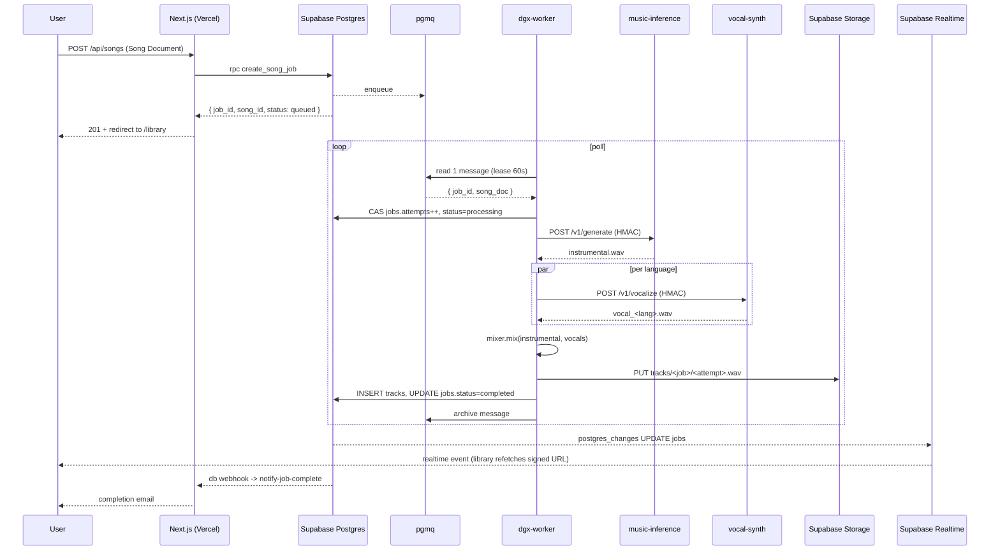

# Architecture review (v1.1 deep-dive)

**Date**: Sprint A of v1.1.
**Scope**: end-to-end system as of `main@1f550ca`. Reviewer is the
in-band agent; this is an honest critique, not a marketing surface.

## 1. System diagram

## 2. Request lifecycle: "user creates a song"

## 3. Component contracts

| Component | Owns | Contract surface | Test posture |
|-----------|------|------------------|--------------|
| `apps/web` (Next.js) | UI, REST/RPC orchestration, RLS-aware queries, signed URL minting | Server actions + REST routes under `app/api/**`; OpenAPI not authoritative for web routes (yet) | vitest under `apps/web/tests/**`; ~64 tests today |
| `packages/song-doc` | Zod schema + JSON Schema codegen target | `SongDocumentSchema.parse()` | unit tests in `src/*.test.ts` |
| `packages/co-composer` | Style-family expanders (Western, Carnatic, Hindustani, Kannada-folk) | `expand(songDoc)` -> `SongDocument` | 43 tests |
| `packages/style-presets` | Curated SongDocument templates | `PRESETS`, `findPreset(id)` | 7 tests |
| `packages/lyrics` | Public-domain lyric provider | `findBundledLyric(id)` | 24 tests |
| `services/music-inference` | HeartMuLa wrapper, HMAC-protected `/v1/generate` | OpenAPI `docs/contracts/openapi-dgx.yaml` | pytest + prod-guard against `FakeMusicModel` |
| `services/vocal-synth` | Singing-voice TTS, HMAC-protected `/v1/vocalize` | OpenAPI `docs/contracts/openapi-vocal-synth.yaml` | pytest |
| `services/dgx-worker` | pgmq consumer, mixer, governor reader, retry/backoff state machine | Internal | pytest + governor gates |
| `infra/supabase` | Migrations 0001–0015, Edge Functions, Storage policies | SQL only | dry-run on local CLI |

## 4. Boundaries that are clean

- **Schema is the truth**. The Zod `SongDocumentSchema` round-trips through JSON Schema (`scripts/song-doc-codegen.py`) and into the Python services. Drift is caught at codegen time.
- **HMAC at every DGX boundary**. `music-inference` and `vocal-synth` only accept signed requests; secrets are env-injected, never in repo.
- **RLS by default**. Every table either has policies or `BYPASSRLS` on the worker role (audited in `docs/REVIEWS/security.md`).
- **Realtime is best-effort**. The library UI doesn't depend on it for correctness; the page-load query also signs a URL. Realtime is purely an accelerator.
- **Co-composer is pure**. No side effects, deterministic given input doc + RNG seed. Trivially testable.
- **Governor is cooperative**. The worker reads the state file at the top of each loop; it never blocks the operator.

## 5. Seams that need attention (v1.1 targets)

- **No app shell.** Every authed page (`/library`, `/songs/new`, `/songs/[id]`) renders its own header. The result is the dead-end UI the user reported. Sprint B in this v1.1 cuts a single `<AppShell>` and route groups `(app)` / `(marketing)`.
- **No auth callback route.** `supabase.auth.signUp({ ... })` is called without `emailRedirectTo`. The confirmation link lands on whatever Supabase has configured as Site URL, which in turn collides with Vercel deployment protection. Sprint C fixes both ends.
- **Orphan completed jobs are unrecoverable.** A `jobs.status = 'completed'` row with no `tracks` row hangs forever in the UI. Worker-side transaction wrapping + a `/recover` endpoint + a 10-minute cron reconciler ship in Sprint C.
- **No song title.** `SongDocumentSchema` has no `title` field; the UI shows `job_id.slice(0, 8)`. Schema-level fix in Sprint C.
- **TTS preprocessing is one line.** No script normalization, no IPA, no prosody hints, no language-aware backend routing. Sprint D rebuilds it from scratch + adds an eval harness.
- **Single-DGX SPOF.** `spark-5208` runs both `music-inference` and `vocal-synth` plus the worker. GPU memory is tight (~19 GB of 64 GB used by HeartMuLa alone). Migration path documented in `docs/PRODUCTION-MIGRATION.md` (Sprint J).
- **Signed URL replay window.** ADR 0012 caps TTL at 1h and refetches on player error; abuse via leaking the URL is a 1h-bounded risk. Mitigation: switch to short-lived (5 min) TTLs + per-IP issuance for public surfaces.
- **No discover / community surface.** All songs are private by default; the only public surface is `/s/[publicId]` after a manual publish. Sprint G builds the feed, profile, likes, follows.
- **Vercel free tier has deployment protection on by default.** Causes the reported (a) bug. Toggle documented in `docs/SECURITY.md`.

## 6. Performance + scale envelope (today)

| Dimension | Today | Headroom | Bottleneck |
|-----------|-------|----------|------------|
| Cold-start time on `/library` | ~600 ms first hit; 200 ms warm | Better with React Cache + edge runtime | Supabase pooler round-trip + 50-row signed-URL fan-out |
| Concurrent in-flight jobs | 1 per worker, 1 worker | Add worker replicas (compose `--scale dgx-worker=2`) + Postgres advisory locks | pgmq lease semantics are correct, GPU is the bottleneck |
| Job p50 wall time | 30–50 s instrumental only; 60–90 s with vocals | Speculative decoding, batched vocal-synth | HeartMuLa autoregressive decode |
| Storage signed-URL TTL | 1 h library, 1 h detail | 5 min refetch on error covers most cases | acceptable for v1.1 |
| Realtime channel cost | 1 channel per library tab | Could move to one channel per row; not necessary at v1 scale | none |
| pgmq queue lag | < 1 s nominal | Already monitored via Sprint 7 exporters | none |

## 7. Failure-mode taxonomy (what we already classify in the worker)

- `inference_http_error`, `inference_timeout`, `inference_preempted` (governor)
- `vocal_lang_failed` (soft-fail, instrumental still shipped)
- `mixer_failed`
- `storage_upload_failed`
- `db_track_insert_failed`
- (Sprint C adds) `orphan_completed` — completed without a tracks row.

Each maps to a Prometheus counter `neo_fm_inference_errors_total{taxonomy=…}` and an alert rule in `infra/grafana/alerts.yaml`.

## 8. Architectural calls deferred to v1.2+

- Multi-tenant model serving (LangCache shared cache, model autoscaling).
- Multi-DGX worker pool with cross-host advisory locks.
- Self-host of Postgres + S3 (currently riding Supabase free tier).
- Stripe / Razorpay billing.
- Admin moderation dashboard for `/discover` reports.
- Public API for third-party integrations.

These are sized in `docs/PRODUCTION-MIGRATION.md`.

## 9. Invariants the codebase quietly enforces

- Every `jobs` row has exactly one `song_documents` parent. Foreign key + `on delete cascade`.
- `sections[].target_seconds` sums to `target_duration_seconds`. Zod refinement.
- Raga system matches style family. Zod refinement.
- Lyric blocklist runs at schema-parse time, before any DGX cycle is burned.
- Quota counts **completed** jobs only (ADR 0014).
- Worker never acks a pgmq message until both `tracks` insert + `jobs.status = completed` succeed. (Sprint C tightens this from "implicit transaction" to "explicit transaction".)

## 10. Verdict

The composition (Vercel + Supabase + DGX) is the right shape for v1. The product surface around the composition is thin, which is what v1.1 fixes. The internal seams between services are clean enough that adding a vocal-synth backend (Sprint D) or a discover surface (Sprint G) doesn't require architectural change — just additive features on the existing contracts.
