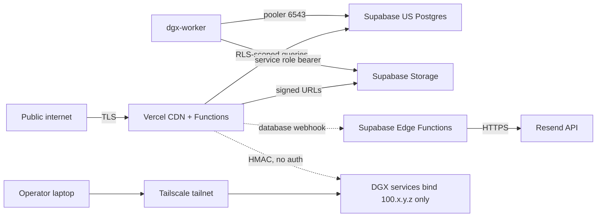

# Security review (v1.1 deep-dive)

**Date**: Sprint A of v1.1.
**Scope**: web app, edge functions, DGX services, Supabase configuration, infra secrets.
**Threat model**: opportunistic attackers (script kiddies, scraping bots), targeted attackers with valid user credentials (account takeover), and authenticated abuse (a paying user trying to exceed quota).

## 1. Trust boundaries

Every cross-boundary call:
- internet -> Vercel: TLS, no other guarantees.
- Vercel -> Supabase: TLS + RLS-aware Postgres role + `sb_secret_*` for admin paths.
- Vercel -> DGX: TLS over Tailscale + HMAC body signature; the DGX services have no other auth.
- Worker -> Supabase: Tailscale + pooler creds (RLS-bypass via `neo_fm_worker` role, scoped grants only).
- Worker -> DGX inference/vocal-synth: localhost-only, HMAC.

## 2. What is fine today

- **HMAC at every DGX boundary**. `services/music-inference` and `services/vocal-synth` both verify SHA-256 HMAC over the body with `X-Signature` and `X-Timestamp`. Replay window is 5 min. Constants-time compare in both.
- **RLS on every public table**. `song_documents`, `jobs`, `tracks`, `quota_consumption`, `public_song_shares`, `signed_url_metadata` all carry policies. Worker role has explicit `BYPASSRLS` only on those tables and explicit grants; not a superuser.
- **No secrets in the repo**. `.env.example` and `.env.dgx.example` are sanitized; CI uses GitHub Actions secrets; Vercel uses the project's encrypted env store.
- **Service role keys never reach the browser**. `apps/web/lib/supabase/admin.ts` is `server-only` and audits trace into route handlers, not RSC.
- **Per-IP rate limit on `/api/songs`**. Fixed window via Upstash Redis (in-memory fallback). Anonymous tier rejects creates; authenticated tier honored.
- **Quota enforced at the DB layer** via `recent_quota_consumption` view + `enforce_song_quota` RPC.
- **Lyric blocklist** (`packages/lyrics`) runs at Zod-parse time, before any DGX cycle is consumed.
- **Signed URLs are short-lived**. Library uses 1 h, detail page uses 1 h, public share uses 24 h; the route handler refuses to mint for songs not owned by the caller (unless explicitly public).
- **Public surfaces (`/s/[publicId]`) require an explicit publish**. Default is private.
- **HTTPS everywhere**. Vercel terminates TLS; Tailscale provides TLS-equivalent transport between operator and DGX.

## 3. Findings and remediations (priority order)

### 3.1 Vercel deployment protection blocks the email-confirmation flow [user-reported (a)]

- **Severity**: medium (blocks onboarding for any new user on a protected deployment).
- **What happens**: A new user signs up; Supabase emails a confirmation link; the link lands on the Vercel deployment URL; deployment protection prompts a Vercel login; the user is locked out unless they happen to be in our Vercel team.
- **Root cause**: deployment protection toggle on the Vercel project is enabled. Even on production, magic-link callbacks have to land on a public URL.
- **Fix (Sprint C)**:
  - Add `app/auth/callback/route.ts` that exchanges the code for a session, sets the cookie via `@supabase/ssr`, and 302s to `next` (default `/library`).
  - Pass `emailRedirectTo: ${origin}/auth/callback?next=/library` from the signup form.
  - In Vercel, set Deployment Protection to **Standard Protection -> Only Preview Deployments** (production gets `live: true`).
  - In Supabase Auth, set Site URL to the production domain and add both `https://*.vercel.app/auth/callback` and `https://neo-fm.app/auth/callback` to redirect URLs.
- **Test**: signup -> click link -> session restored on production without Vercel login.

### 3.2 Three SECURITY DEFINER functions need explicit search_path lockdown [Supabase advisor]

- **Severity**: medium (path-injection-style escalation theoretical; Supabase flags as best-practice).
- **Functions**: `public.create_song_job`, `public.enforce_song_quota`, `public.atomic_pgmq_dequeue`.
- **Fix (Sprint I)** via migration `0026_security_definer_lockdown.sql`:
  - `SET search_path = '';` inside each function body.
  - Fully qualify every referenced object (`public.jobs`, `pgmq.q_song_jobs`, etc.).
  - Re-run `supabase db lint` to confirm advisor zero-finding.
- **ADR**: `0021-security-definer-review.md`.

### 3.3 Leaked-password protection is off

- **Severity**: low (defense in depth; Supabase already enforces 8+ chars).
- **Fix (Sprint I)**: enable `auth.password.minimumLength = 10`, enable `auth.password.haveIBeenPwned = true` via Supabase config.
- **Test**: rejected sign-up on a known-leaked password.

### 3.4 No CSP / HSTS / referrer policy on Vercel

- **Severity**: medium (XSS surface, third-party leakage).
- **Fix (Sprint I)** in `apps/web/middleware.ts`:
  - `Content-Security-Policy: default-src 'self'; img-src 'self' data: blob: https://*.supabase.co; media-src 'self' blob: https://*.supabase.co; script-src 'self' 'wasm-unsafe-eval'; style-src 'self' 'unsafe-inline'; connect-src 'self' https://*.supabase.co wss://*.supabase.co; frame-ancestors 'none';`
  - `Strict-Transport-Security: max-age=63072000; includeSubDomains; preload`
  - `X-Content-Type-Options: nosniff`
  - `Referrer-Policy: strict-origin-when-cross-origin`
  - `Permissions-Policy: camera=(), microphone=(), geolocation=()`
- **Test**: `securityheaders.com` rating A or higher.

### 3.5 No brute-force throttle on `/sign-in`

- **Severity**: medium (credential-stuffing surface).
- **Fix (Sprint I)**: per-(IP, email) sliding window in `apps/web/middleware.ts`:
  - 5 attempts per IP per 5 min -> 429.
  - 10 attempts per email per 1 h -> Supabase admin lockout (or a deny list, depending on availability of admin endpoint).
- **Storage**: same Upstash Redis used by `/api/songs`; in-memory fallback in dev.

### 3.6 No `/api/health` endpoint

- **Severity**: low (operability, not security per se).
- **Fix (Sprint I)**: `app/api/health/route.ts` returns 200 + JSON `{ web: 'ok', db: '<ms>', storage: '<ms>' }`. Used by Vercel monitoring + Sprint J runbook.

### 3.7 Signed-URL replay window

- **Severity**: low (1 h leak of a single user's audio).
- **Mitigation**: switch player retry to 5 min TTL with on-error refetch (ADR 0012 already permits this; Sprint H wires it into the spectrogram component which controls playback).

### 3.8 No abuse logging for `/api/songs/[id]/audio-url`

- **Severity**: low (forensics, not prevention).
- **Mitigation**: 429s already log; Sprint I adds a structured log line on every successful mint (`signed_url_minted`) with `request_id`, `user_id`, `song_id`, `ttl`.

### 3.9 Stems endpoint (Sprint H) requires careful access control

- **Severity**: would-be medium if shipped naive.
- **Plan**: `app/api/songs/[id]/stems/route.ts` mints signed URLs **only if** the caller owns the song or the song is published *and* the publish row includes `allow_stems: true`. Default `allow_stems: false`.

### 3.10 Discover / social abuse vectors (Sprint G)

- **Mitigations baked in**:
  - Likes table is `(user_id, song_id)` unique, no anonymous likes.
  - Followers table likewise unique on `(follower, target)`.
  - Reports table has rate limiting at the policy level (max 50 reports per user per day).
  - All public profiles default to handle-only; email never exposed.
  - `users.handle` column has a `CHECK (handle ~ '^[a-z0-9_]{3,24}$')` and a unique index.

## 4. Secrets inventory

| Secret | Stored where | Rotation cadence | Touch points |
|--------|--------------|------------------|--------------|
| `SUPABASE_SERVICE_ROLE_KEY` | Vercel env + DGX `.env.dgx` | yearly or on incident | Worker, web admin paths |
| `SUPABASE_DB_PASSWORD` | Vercel env (pooler URI), DGX `.env.dgx` | yearly | Worker pooler URI |
| `DGX_HMAC_SECRET` | Vercel env + DGX `.env.dgx` | quarterly | Web `/api/songs` -> DGX, worker -> inference |
| `VOCAL_SYNTH_HMAC_SECRET` | Vercel env + DGX `.env.dgx` | quarterly | Worker -> vocal-synth |
| `RESEND_API_KEY` | Supabase edge fn secret | yearly | notify-job-complete |
| `HF_TOKEN` | DGX `.env.dgx` | yearly | Worker model downloads |
| `UPSTASH_REDIS_REST_*` | Vercel env | yearly | rate limiter |
| `TAILSCALE_AUTHKEY` (if rejoining) | Operator-only | per-host | DGX node join |

## 5. Compliance posture (v1.1 honesty pass)

- **Data residency**: Supabase project is US-east. Indian PII flows through US infrastructure. Documented in `docs/SECURITY.md` Sprint J; production migration plan ships an APAC region path.
- **PII collected**: email, password hash, handle, songs/lyrics (could include PII if user types it). No financial info, no health info. Quota and rate-limit logs are 30-day retained.
- **Right to deletion**: Sprint E `/account` page has an explicit "Delete account" flow that wipes `auth.users`, `users`, `song_documents`, `jobs`, `tracks`, plus storage bucket prefix. Uses a service-role admin RPC.
- **Data export**: Sprint E `/account` page returns a tarball of the user's song documents + signed URLs.

## 6. Open risks accepted for v1.1

- Single-region (US-east). No DR. Backups are Supabase free-tier (7-day PITR).
- No formal penetration test. Self-audited only.
- Public-domain lyric provider is `packages/lyrics`; user-uploaded lyrics are accepted with a blocklist but no rights-screening pipeline. Documented in OPERATOR-HANDOFF.

## 7. Verdict

The infrastructure-level posture (HMAC, RLS, no-secrets-in-repo, short TTLs, blocklist) is sound. The user-experienced security defects (deployment protection collision, missing headers, missing brute-force throttle) are concentrated in the Vercel and middleware layer and ship in Sprint I. SECURITY DEFINER lockdown ships in Sprint I.
