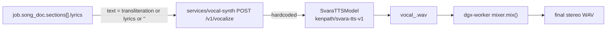
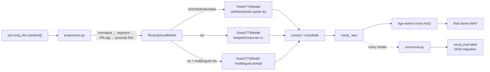

# TTS / vocal synthesis review (v1.1 deep-dive)

**Date**: Sprint A of v1.1.
**Scope**: end-to-end vocal pipeline — text input -> preprocessing ->
backend model -> WAV -> mixer. Directly addresses user-reported bug
(d): "weak phonetics, doesn't match language and music style."

## 1. Today's pipeline



The relevant code lives in `services/vocal-synth/app/model.py`:

```python
class SvaraTTSModel:
    def synthesize(self, sec, lang):
        text = sec.transliteration or sec.lyrics or ""
        return self._model.tts(text, lang=lang, ...)
```

That's the whole preprocessing layer.

## 2. What's wrong

### 2.1 No script normalization

- Indic input is Unicode but our model expects normalized NFC + canonical halant placement. Composed vs decomposed Devanagari (`क` U+0915 vs `क + ्ा`) sounds different to the model.
- ZWJ (U+200D) and ZWNJ (U+200C) are present in user-typed lyrics but the model treats them as noise; we should strip or convert to `+` boundary markers per the SvaraTTS docs.
- Vowel signs vs independent vowels get confused after a virama; the model bias is toward independent vowels.

### 2.2 No IPA fallback for English-mixed Indic ("Hinglish")

- A line like `"Cafe में bumblebee"` gets tokenized character-by-character. The English words sound robotic. We need a per-word language detector + per-word IPA conversion for the cross-lingual tokens.

### 2.3 No prosody hints

- Indian classical lyrics rely on heavy elongation (`gaaaaaa` vs `ga`). Our text has no `_` or sustain hints. The vocal-synth model can take SSML-style hints but we don't emit them.
- No accent placement; everything sounds flat.
- No breath markers; we should insert them between sections automatically.

### 2.4 No utterance segmentation

- Sections are passed as a single string. A 30-second chorus = 30 seconds of one continuous utterance, which all TTS models hate. We should split into ~8 s utterances on punctuation / line break and concatenate.

### 2.5 No backend routing by language or style

- Hindi/Marathi/Tamil/Telugu/Bengali all go to SvaraTTS, which is trained on a specific Indic mix and is weakest on Tamil and Bengali. AI4Bharat's **Indic Parler TTS** is stronger on Tamil + Bengali + Malayalam + Assamese and offers prompt-conditioned voice style.
- English-only songs go to SvaraTTS too; its English is weakest. Should route to a Western backend (`microsoft/speecht5_tts` or `facebook/mms-tts-eng`).

### 2.6 No quality evaluation

- We have no way to know if a render is better or worse than yesterday's. No regression catch.
- Subjective listening alone doesn't scale.

## 3. The new pipeline (Sprint D)



### 3.1 `services/vocal-synth/app/preprocess.py`

Stateless module with these functions:

```python
def normalize_unicode(text: str) -> str: ...        # NFC + ZWJ rules
def detect_language_mix(text: str) -> list[Span]: ... # per-token lang detection
def ipa_tag(text: str, primary_lang: str) -> str: ... # adds [IPA] hints for foreign tokens
def add_prosody_hints(text: str, section: Section, style_family: str) -> str:
    """Insert ~ for sustain, , for breath, . for terminal."""
def segment_into_utterances(text: str, max_seconds: float = 8.0) -> list[Utterance]: ...
```

Each function is pure, testable, and has a unit-test suite with golden inputs in `services/vocal-synth/tests/golden/`.

### 3.2 `RoutingVocalModel`

Wraps:

```python
backends = {
    "ta": parler,
    "te": parler,
    "kn": parler,
    "bn": parler,
    "ml": parler,
    "as": parler,
    "hi": svara,     # SvaraTTS has the strongest Hindi
    "mr": svara,
    "sa": svara,
    "en": en_backend,  # microsoft/speecht5_tts
    "mixed": svara_multilingual,
}
```

Selection happens after `preprocess.detect_language_mix(text)`:
- If any single language dominates ≥ 80% by token count, use that backend.
- Else use `svara_multilingual` with per-span language hints.

A fallback chain is encoded: if Parler isn't ready (warmup), try SvaraTTS; if both unavailable, return 503 with a structured taxonomy so the worker logs it (`vocal_backend_unavailable`).

### 3.3 `scripts/vocal-eval.py` — quality harness

Runs over a fixed set of 24 reference SongDocuments (4 styles × 6 languages):

```python
metrics_per_render = {
    "duration_s": float,                  # ground truth target match
    "mos_estimate": float,                # NISQA-like reference-free MOS
    "phoneme_accuracy_estimate": float,   # ASR alignment back to reference text
    "f0_smoothness": float,               # librosa-based detection of artifacts
    "snr_estimate": float,
}
```

Writes results to `vocal_eval` table (Sprint D migration `0018`). A simple regression check: any render where any metric drops by > 5% triggers an alert in CI.

### 3.4 Database: `vocal_eval` table

```sql
create table if not exists public.vocal_eval (
  id uuid primary key default gen_random_uuid(),
  job_id uuid references public.jobs(id),
  language text not null,
  backend text not null,
  mos_estimate numeric,
  phoneme_accuracy_estimate numeric,
  f0_smoothness numeric,
  snr_estimate numeric,
  created_at timestamptz default now()
);
```

### 3.5 Prometheus exports

- `neo_fm_vocal_preprocess_seconds`
- `neo_fm_vocal_backend_count{backend, language}`
- `neo_fm_vocal_eval_mos_estimate{language, backend}`

### 3.6 ADR

`docs/DECISIONS/0020-vocal-multibackend-and-eval.md` documents:
- Why Parler (license, language coverage, voice-prompt steering).
- Why we keep SvaraTTS as fallback (warmer Hindi, lower latency).
- Why we don't use Bark or VITS in v1.1 (license + GPU cost).

## 4. Test plan (Sprint D)

- Unit tests on `preprocess.py` for each function (golden file based).
- Integration test: per-language synthesis round-trip, byte equality on stub backend.
- Regression test: `vocal-eval.py` over the 24 reference docs; CI fails if MOS estimate drops > 5%.
- End-to-end: enqueue 6 jobs (one per language) on the live worker; verify outputs are non-silent (RMS > 0.01) and survive the mixer.

## 5. What we are explicitly *not* doing in v1.1

- Custom voice cloning (out of scope; would also raise consent/ethics work).
- Karaoke recording loopback (deferred to v1.2; see wow-factors.md #13).
- Real-time streaming TTS (requires chunked WebAudio pipeline; v1.2).
- Multi-speaker harmony stacks (the mixer already supports two voices; UI exposure deferred).

## 6. Verdict

The bug "weak phonetics" is a stack-deep problem, not a model knob. Fixing it requires real preprocessing + a second backend + an eval harness. Sprint D does all three, ships an ADR, and adds the first regression test that a future change can fail.
