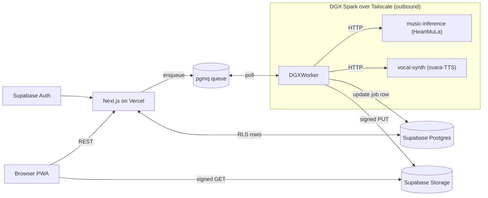

# neo-fm — Technical Specification

Status: living document. Owners: SharathSPhD.

## 1. System overview

neo-fm is an India-first, composition-aware AI music platform. It takes a user theme or lyrics, produces a structured **Song Document**, expands it through style-aware **co-composition** rules, and renders a multi-minute audio track via **HeartMuLa** (instrumental + non-Indic vocals) with optional **svara-TTS** layered Indic vocals.

The system is split across three runtime tiers:

- **Cloud** (Vercel + Supabase): web UI, REST API, auth, persistence, queue.
- **DGX Spark** (Docker over Tailscale, outbound only): music-inference, dgx-worker, vocal-synth.
- **External**: Pratyabhijna creative engine (Phase 10).

## 2. Architecture



### 2.1 Trust boundary

Cloud → DGX traffic is impossible by design. The DGX initiates all connections: it polls Supabase Postgres (`pgmq`), reads Song Documents, writes job status, and uploads audio via signed PUT URLs. The cloud never holds DGX credentials beyond what Tailscale exposes to the DGX itself.

## 3. Component contracts

Authoritative API definitions live next to this spec:

- Cloud API: [contracts/openapi-cloud.yaml](contracts/openapi-cloud.yaml).
- DGX music-inference: [contracts/openapi-dgx.yaml](contracts/openapi-dgx.yaml).
- Queue message: [contracts/queue-message.schema.json](contracts/queue-message.schema.json).

The Cloud API is the **only** public surface. The DGX API is internal — only `dgx-worker` calls it, over the loopback or the docker-compose network.

### 3.1 Cloud API summary

| Method | Path                    | Purpose                                              |
| ------ | ----------------------- | ---------------------------------------------------- |
| `POST` | `/api/auth/signup`      | Supabase Auth passthrough.                           |
| `POST` | `/api/auth/login`       | Supabase Auth passthrough.                           |
| `GET`  | `/api/me`               | Current user profile + tier.                         |
| `POST` | `/api/songs`            | Submit Song Document or prompt → enqueue job.        |
| `GET`  | `/api/songs`            | List user songs.                                     |
| `GET`  | `/api/songs/{id}`       | One song with job status and signed audio URL.       |
| `GET`  | `/api/healthz`          | Liveness.                                            |

### 3.2 DGX music-inference summary

| Method | Path             | Purpose                                                                   |
| ------ | ---------------- | ------------------------------------------------------------------------- |
| `POST` | `/v1/generate`   | Generate audio for one Song Document (one or more sections).              |
| `GET`  | `/healthz`       | Liveness + readiness; reports model version, GPU memory, model_loaded.    |

### 3.3 Queue message — `SongGenerationJob`

See [contracts/queue-message.schema.json](contracts/queue-message.schema.json). Fields: `job_id`, `user_id`, `song_document_id`, `priority`, `created_at`, `style_family`, `target_duration_seconds`.

## 4. Song Document DSL

The Song Document is the canonical structured representation across all layers (Pratyabhijna → co-composer → HeartMuLa). Source of truth: [packages/song-doc/src/index.ts](../packages/song-doc/src/index.ts) (Zod). Python mirror: [packages/song-doc/python/neo_fm_song_doc/models.py](../packages/song-doc/python/neo_fm_song_doc/models.py).

### 4.1 Top-level shape

```ts
SongDocument {
  id: UUID
  user_id: UUID
  language: "en" | "hi" | "kn"                                  // ISO 639-1, v1 enum
  style_family: "western" | "carnatic" | "hindustani" | "kannada-folk"
  tempo_bpm?: number                                            // 30..240
  time_signature?: string                                       // e.g. "4/4"
  tala?: string                                                 // e.g. "teentaal", "adi"
  target_duration_seconds: 30 | 60 | 90 | 180                   // v1 enum
  sections: Section[]
  orchestration?: Orchestration
  raga?: RagaSpec
  metadata?: Record<string, unknown>
}
```

`target_duration_seconds` is the locked v1 enum. Each `Section.target_seconds`
is the sub-budget for that section; the co-composer guarantees
`sum(section.target_seconds) <= target_duration_seconds` (with auto-allocation
of any unset section budgets).

### 4.2 Section enum (v1)

Style-agnostic union covering Western, Carnatic, Hindustani, and folk forms:

```
intro | verse | chorus | bridge | outro |
pallavi | anupallavi | charanam |
mukhda | antara |
saranam |
alaap | sargam |
folk_refrain | folk_stanza
```

Each section carries: `id`, `type`, optional `lyrics`, optional `script` (Devanagari/Tamil/Kannada/Latin), optional `transliteration`, optional `swara_sequence` (sargam), optional `phonemes` (Phase 7), `target_seconds`.

### 4.3 RagaSpec

```ts
RagaSpec {
  name: string            // "kalyani", "yaman", "bhairavi"
  system: "carnatic" | "hindustani"
  arohana?: string[]      // ["S", "R2", "G3", "M2", "P", "D2", "N3", "S'"]
  avarohana?: string[]
  nyas?: string[]
  pakad?: string
}
```

### 4.4 Orchestration

```ts
Orchestration {
  lead_vocal?: "male" | "female" | "instrumental"
  instruments?: string[]   // ["mridangam", "tanpura", "violin"]
  texture?: string         // "sparse", "full-band", "drone+lead"
}
```

## 5. Data model (Supabase, Phase 4)

```sql
users           (id PK, email, name, locale, tier, created_at)
song_documents  (id PK, user_id FK, language, style_family,
                 document_json JSONB, created_at)
jobs            (id PK, user_id FK, song_document_id FK,
                 status, priority,
                 progress NUMERIC(4,3) DEFAULT 0,           -- 0.000..1.000
                 attempts INTEGER DEFAULT 0,
                 attempt_id UUID,                            -- ADR 0008
                 trace_id TEXT,                              -- ADR 0007
                 last_attempt_at TIMESTAMPTZ,
                 lease_renewed_at TIMESTAMPTZ,
                 error TEXT, created_at, started_at, finished_at)
tracks          (id PK, job_id FK, attempt_id UUID,         -- ADR 0008 idempotency
                 url, bytes BIGINT, duration_seconds, format,
                 expires_at TIMESTAMPTZ,                     -- ADR 0005 signed URL TTL
                 deleted_at TIMESTAMPTZ,                     -- ADR 0005 soft delete
                 created_at)
subscriptions   (id PK, user_id FK, plan, status, renew_at, cancel_at)
```

Row-level security (full matrix):

- `users` — `SELECT WHERE id = auth.uid()`; `UPDATE` limited to non-tier
  columns by self; `tier` writes only from `service_role`.
- `song_documents`, `jobs`, `tracks` — `SELECT/INSERT WHERE user_id = auth.uid()`;
  `UPDATE` of status fields restricted to the dedicated `neo_fm_worker` role
  (ADR 0004); end users cannot mutate `jobs.status`/`progress`/`error` directly.
- `subscriptions` — `SELECT WHERE user_id = auth.uid()`; **no** `INSERT` /
  `UPDATE` / `DELETE` from authenticated users; only `service_role` writes
  (subscription state is managed by the billing surface, post-v1).

Queue: pgmq `song_generation_jobs` + DLQ `song_generation_jobs_dlq`, polled
by `dgx-worker` under `neo_fm_worker` role. Decisions:
[ADR 0001 (queue choice)](DECISIONS/0001-queue.md),
[ADR 0004 (worker role)](DECISIONS/0004-worker-db-role.md),
[ADR 0008 (leases + retries + DLQ)](DECISIONS/0008-pgmq-leases.md).

Realtime: `jobs` table is published to Supabase Realtime; the web UI
subscribes to `WHERE user_id = auth.uid()` and shows `status` + `progress`.

## 6. Models and licenses

| Model                       | License                            | Role                                |
| --------------------------- | ---------------------------------- | ----------------------------------- |
| `m-a-p/HeartMuLa-oss-3B`    | Apache 2.0                         | Instrumental + non-Indic vocals     |
| `kenpath/svara-tts`         | (verify at integration, Phase 7)   | Indic singing voice                 |
| AI4Bharat Indic-TTS         | MIT-style / open                   | G2P for 13 Indian languages         |
| IITM Indic-TTS CLS          | Research-use                       | Common Label Set phoneme inventory  |

Weight downloads are gitignored. Phase 1 commits the download script and a model-card snapshot, not the weights themselves.

## 7. TRIZ contradictions and resolutions

These are also tracked as ADRs under [DECISIONS/](DECISIONS/) and resolved through `contradiction-agent → solution-agent → evaluator-agent`.

- **C1: DGX runs music AND must stay free for LLM fine-tuning** → #15 Dynamism + #25 Self-service. Utilization-aware governor in `dgx-worker` reading `nvidia-smi`; music capped at ≤50% GPU; priority queue lets fine-tuning preempt.
- **C2: Low UX latency AND batch offline** → #1 Segmentation + #10 Preliminary action. Per-section generation streamed via Supabase Realtime; **eager model load at container boot** so the first request hits a hot model.
- **C3: Authentic Indian vocals AND HeartMuLa weak on Indic phonetics** → #5 Merging + #28 Mechanics substitution. HeartMuLa renders instrumental; svara-TTS renders vocals from melody + Indic G2P phonemes; mixer stitches stems.
- **C4: Free service AND zero infra cost AND high quality** → #2 Taking out. No paid third-party APIs; on-prem DGX + Supabase/Vercel free tiers. Optional `LyriaProEngine` adapter ships in Phase 12 for paying users only.
- **C5: Real impl (no mocks) AND fast iteration** → #1 Segmentation + #10 Preliminary action. Smallest real artifact first (FP16 3B, 30s clip), expand outward.
- **C6: Internal services must be cheap AND auth'd** → #25 Self-service + #28 Mechanics substitution. Shared-secret HMAC over body+timestamp (ADR 0003); rejects unauthenticated callers without standing up a CA or mTLS bus for two containers.
- **C7: Worker needs DB power AND must not see private user data** → #1 Segmentation + #3 Local quality. Dedicated `neo_fm_worker` Postgres role with column-level grants on `jobs`, insert on `tracks`, zero access to `users`/`subscriptions` (ADR 0004). Two-layer protection: RLS in the cloud, role grants at DB.
- **C8: Observability must be useful early AND cheap to add** → #1 Segmentation + #10 Preliminary action. Split obs: structured JSON logs from Phase 1, cross-service `trace_id` from Phase 4, Prometheus+Grafana+alerts in Phase 11 (ADR 0007). Each phase pays only for what it ships.
- **C9: Free tier must be free AND storage must be bounded** → #2 Taking out + #15 Dynamism. Tier-based byte caps + retention windows + lossy default format on free tier (ADR 0005). Free users get MP3 + 30-day retention; pro users get lossless + indefinite.
- **C10: Public-domain corpus must be legally safe AND maintainable** → #25 Self-service + #28 Mechanics substitution. Frontmatter-enforced provenance per file + CI validator (ADR 0006). Provenance is data, not a claim in a single doc; corrupting it requires editing the file *and* faking the source URL.

## 8. Observability (incremental, ADR 0007)

Observability lands across three phases, not all at once:

**Phase 1 — structured JSON logs (single service)**
- `music-inference` emits one JSON line per request to `/v1/generate` with
  `request_id`, `model_version`, `gpu_memory_used_mb`, `wall_seconds`,
  `status`.
- `/healthz` reports `model_loaded`, `model_version`, `gpu_memory_used_mb`,
  `gpu_utilization_pct`.
- No Prometheus, no Grafana yet.

**Phase 4 — cross-service trace correlation**
- `dgx-worker` and the cloud API emit JSON logs in the same shape.
- `trace_id` is generated by the cloud API on `POST /api/songs`,
  propagated through the queue message (`queue-message.schema.json`),
  then through the worker's call to `/v1/generate` via
  `X-NeoFM-Trace-Id`.
- A single song job is now one queryable trail across cloud, worker,
  and DGX.

**Phase 11 — Prometheus + Grafana + alerts**
- Exporters in `music-inference`, `dgx-worker`, `vocal-synth`.
  Endpoint `GET /metrics`.
- Grafana dashboard JSON committed under [infra/grafana/](../infra/grafana/).
- Health endpoints upgraded to also expose queue lag and jobs/min.
- Alert rules: GPU util > threshold (default 50% for music), job-lag > 60s,
  HeartMuLa error rate > 1% over 5 min, DLQ depth > 10.

## 9. Phase deliverables matrix

| Phase | Demo artifact                                                | Container builds | Endpoint output                 |
| ----- | ------------------------------------------------------------ | ---------------- | ------------------------------- |
| 0     | `demos/phase-0-dgx.txt`, `demos/phase-0.png`                 | (skeleton)       | n/a                             |
| 1     | `demos/phase-1.wav` + `nvidia-smi` screenshot                | music-inference  | real 30s WAV                    |
| 2     | `demos/phase-2.wav` + golden snapshot test                   | music-inference  | Western SongDoc → WAV           |
| 3     | `demos/phase-3.wav` + lyrics-from-library                    | music-inference  | real lyrics + 30s WAV           |
| 4     | end-to-end signed URL                                        | + dgx-worker     | `POST /api/songs` → ready track |
| 5     | `demos/phase-5.gif` of full UX flow                          | + apps/web       | UI submits and plays            |
| 6     | one 90s WAV per Indian style                                 | (no new image)   | style-correct outputs           |
| 7     | A/B WAVs HeartMuLa-only vs HeartMuLa+svara-TTS               | + vocal-synth    | Indic vocal layered             |
| 8     | governor load-test transcript                                | (no new image)   | worker yields to fine-tune      |
| 9     | PWA install screenshot + quota enforcement test              | (no new image)   | quota 429 on N+1                |
| 10    | `POST /api/songs` with `prompt` → Kannada SongDoc + 90s WAV  | (no new image)   | real Pratyabhijna output        |
| 11    | `demos/phase-11-grafana.png` + alert-fired screenshot        | exporters in all | metrics visible                 |
| 12    | A/B WAV `HeartMuLa` vs `Lyria 3 Pro`                         | (no new image)   | pro-tier routing                |

## 10. v1 scope (locked)

- **Surface**: web only. Mobile (React Native/Expo) is post-v1.
- **Styles**: Western, Carnatic, Hindustani, Kannada-folk.
- **Languages**: English, Hindi, Kannada.
- **Durations**: 30 s, 60 s, 90 s, 3 min (30 s and 3 min are the phase-gated targets).
- **Storage**: tier-capped per ADR 0005 (free 500 MB / creator 5 GB / pro 50 GB).
- **Out of scope**: payments, public MCP exposure, managed-API pro tier (Phase 12 deferred).

## 11. Cross-cutting concerns

| Concern             | Lands in       | Reference                                 |
| ------------------- | -------------- | ----------------------------------------- |
| Internal-API auth   | Phase 1        | [ADR 0003](DECISIONS/0003-internal-api-hmac.md) |
| Worker DB grants    | Phase 4        | [ADR 0004](DECISIONS/0004-worker-db-role.md)    |
| Storage retention   | Phase 4 + 9    | [ADR 0005](DECISIONS/0005-storage-retention.md) |
| Lyrics provenance   | Phase 3        | [ADR 0006](DECISIONS/0006-lyrics-provenance.md) |
| Observability       | Phase 1, 4, 11 | [ADR 0007](DECISIONS/0007-observability-from-phase-1.md) |
| Queue retries / DLQ | Phase 4        | [ADR 0008](DECISIONS/0008-pgmq-leases.md)       |
| Abuse mitigations   | Phase 4 + 9    | [PRD §10](PRD.md)                          |
