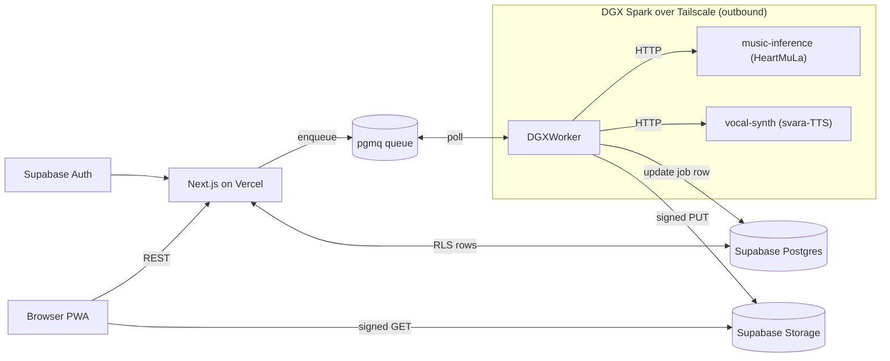

## Locked stack

- **Web**: Next.js 14 (App Router) on Vercel, Shadcn + Tailwind, PWA-installable
- **API / Auth / DB / Storage**: Supabase (Postgres + RLS + Auth + Storage)
- **Queue**: pgmq inside Supabase Postgres (pg-boss vs pgmq ADR decided in Phase 0 → `docs/DECISIONS/0001-queue.md`; ADR picked pgmq)
- **DGX side** (Docker on DGX OS, NVIDIA Container Runtime preinstalled):
  - `services/music-inference` — FastAPI + `heartmula` lib + `m-a-p/HeartMuLa-oss-3B` weights, base `nvcr.io/nvidia/pytorch:24.08-py3`
  - `services/dgx-worker` — Python poller (pgmq client via `psycopg`), calls music-inference, uploads to Supabase Storage
  - `services/vocal-synth` (Phase 7) — svara-TTS (`kenpath/svara-tts`) + AI4Bharat Indic-TTS G2P for Hindi/Kannada singing voice
- **Tunnel**: Tailscale (DGX outbound only; cloud never reaches inward)
- **Models**: `m-a-p/HeartMuLa-oss-3B` (Apache 2.0), `kenpath/svara-tts`, AI4Bharat Indic-TTS
- **Creative engine**: Pratyabhijna (external prompt → Song Document); integrated as `PratyabhijnaProvider` real impl in Phase 10
- **Observability**: Prometheus exporters + Grafana dashboards on DGX containers; alerts on GPU util, job lag, HeartMuLa error rate (Phase 11)
- **Optional pro tier (deferred, post-v1)**: managed-API fallback via `MusicEngine` adapter — `LyriaProEngine` and/or `SunoEngine` for paying users on styles where HeartMuLa lags (Phase 12)
- **v1 scope**: web only; styles {Western, Carnatic, Hindustani, Kannada folk}; langs {en, hi, kn}; durations {30s, 60s, 90s, 3min} with 30s & 3min phase-gated; no payments, no MCP exposure

## Architecture

## Contradictions resolved via TRIZ

- **C1: DGX runs music AND must stay free for LLM fine-tuning** → #15 Dynamism + #25 Self-service: utilization-aware governor in `dgx-worker` reading `nvidia-smi`; music capped at ≤50% GPU; priority queue lets fine-tuning preempt.
- **C2: Low UX latency AND batch offline** → #1 Segmentation + #10 Preliminary action: per-section generation streamed via Supabase Realtime; eager model load at container boot.
- **C3: Authentic Indian vocals AND HeartMuLa weak on Indic phonetics** → #5 Merging + #28 Mechanics substitution: HeartMuLa renders instrumental; svara-TTS renders vocals from melody + Indic G2P phonemes; mixer stitches stems.
- **C4: Free service AND zero infra cost AND high quality** → #2 Taking out: no paid third-party APIs; on-prem DGX + Supabase/Vercel free tiers.
- **C5: Real impl (no mocks) AND fast iteration** → #1 Segmentation + #10 Preliminary action: smallest real artifact first (FP16 3B, 30s clip), expand outward.

Each contradiction gets an ADR under `docs/DECISIONS/` invoking `plugin-triz-engine` MCP through `contradiction-agent` → `solution-agent` → `evaluator-agent`.

## Repo skeleton (`SharathSPhD/neo-fm`, public, pnpm + Turborepo)

- `apps/web/` — Next.js + Vercel
- `services/music-inference/` — FastAPI + HeartMuLa (Docker, DGX)
- `services/dgx-worker/` — pgmq poller (Docker, DGX)
- `services/vocal-synth/` — svara-TTS (Docker, DGX, Phase 7)
- `packages/song-doc/` — TS + Python pydantic Song Document DSL
- `packages/co-composer/` — style modules (western, carnatic, hindustani, kannada-folk)
- `packages/lyrics/` — `LyricsProvider` interface + `PublicLyricsLibraryProvider` + `PratyabhijnaProvider` seam
- `data/public-lyrics/` — real public-domain lyrics (Purandaradasa, DVG, Kabir, Tulsidas, Tagore, Blake, Whitman, Sanskrit)
- `docs/` — `SPEC.md`, `PRD.md`, `IMPLEMENTATION_PLAN.md`, `DECISIONS/` (ADRs incl. TRIZ logs)
- `demos/` — phase-N evidence (`phase-N.wav`, `phase-N.gif`, `phase-N.png`)
- `infra/supabase/` — SQL migrations; `infra/docker-compose.dgx.yml`
- `.github/workflows/` — CI

## Phase gating contract (Ralph-Wiggum promise)

A phase advances iff **all five** hold:
1. CI green AND `dgx-smoke` job green where the phase touches DGX behavior
2. Container(s) build and start on real DGX (compose stdout captured under `demos/phase-N-bringup.txt`)
3. Endpoint returns real, listenable output for at least one real input (`ffprobe`-verified for audio; visual diff for UI)
4. A demo artifact (`demos/phase-N.{wav,gif,png,txt}`) is committed AND reproducible from the merged SHA via `scripts/build-demo.sh phase-N`
5. Adversarial subagent (`ce-adversarial-reviewer` or domain reviewer) reviewed the diff; any blocker findings are resolved or filed as ADRs

`verification-before-completion` skill enforces this; `architect-review` + `ce-code-review` run at each phase boundary; `tdd-orchestrator` enforces TDD inside each worktree.

## Multi-agent orchestration

- Frontend → `ce-frontend-design`, `nextjs` skill, `react-best-practices`
- DGX services → `fastapi-pro`, `python-pro`, `ai-engineer`
- Cloud API + Supabase → `backend-architect`, `supabase` skill, `event-sourcing-architect` (job lifecycle)
- Data prep (lyrics corpus) → `data-engineer`
- Reviews → `architect-review`, `ce-architecture-strategist`, `ce-correctness-reviewer`, `ce-code-simplicity-reviewer`
- Debug → `debugger`, `systematic-debugging` skill
- TRIZ contradictions → `contradiction-agent` → `solution-agent` → `evaluator-agent` (plus `plugin-triz-engine` MCP)
- Each phase parallelized via `dispatching-parallel-agents` once Phase 0–1 vertical slice is green

## Periodic GitHub push policy

- Every passing phase merges its worktree branch into `main` via PR (squash) with the demo committed.
- Within a phase, push the worktree branch at every green test run.
- Git identity: `git config user.name SharathSPhD`, `user.email ""`; commits use `--allow-empty` only for phase-tag commits.

## Phases (each ends with `demos/phase-N.*` + green CI + container up)

1. **Phase 0 — Bootstrap on DGX.** Agent runtime is now on DGX (env reports `linux 6.17.0-1014-nvidia` at `/home/sharaths/projects/neo-fm`); commit `demos/phase-0-dgx.txt` with `nvidia-smi`, `docker --version`, and `tailscale status` output as proof. Create public repo `SharathSPhD/neo-fm`, scaffold monorepo (pnpm + Turborepo), CI stub, AGENTS.md, CLAUDE.md. Write `docs/SPEC.md` + `docs/PRD.md` + `docs/IMPLEMENTATION_PLAN.md` v1. Decide pg-boss vs pgmq and commit ADR `docs/DECISIONS/0001-queue.md`. First push to `main` with `demos/phase-0.png` (repo screenshot).
2. **Phase 1 — Real music-inference container (vertical slice).** Build & run `services/music-inference` on DGX, generate a 30s WAV from real lyrics end-to-end on the GPU. Demo: `demos/phase-1.wav` + `nvidia-smi` screenshot.
3. **Phase 2 — Song Document DSL + Western co-composer.** Parallel worktrees `phase/2a-song-doc` + `phase/2b-cocomposer-western`. TDD with golden files. Demo: golden test render of Western Song Document → WAV.
4. **Phase 3 — Public-lyrics provider + Pratyabhijna seam.** Real corpus under `data/public-lyrics/`, `LyricsProvider` interface, `PublicLyricsLibraryProvider`, stubbed `PratyabhijnaProvider`. Demo: API returns real lyrics + 30s WAV from selected piece.
5. **Phase 4 — Supabase schema + cloud API + dgx-worker.** Parallel worktrees `4a/4b/4c`. Postgres schema, pgmq queue, Next.js API routes, Python worker on DGX. Demo: `curl POST /api/songs` → finished URL in Supabase Storage.
6. **Phase 5 — Web UI (creation canvas, library, playback).** Auth, creation form (style/lang/duration/lyrics picker), Realtime status, audio player, PWA scaffold. Demo: `demos/phase-5.gif` of full UX.
7. **Phase 6 — Carnatic + Hindustani + Kannada-folk modules.** Parallel `phase/6a/6b/6c` via subagents. Each adds raga/tala/instrumentation rules + HeartMuLa tag mapping. Demo: one 90s WAV per style.
8. **Phase 7 — Indic phonetics + svara-TTS vocal layer.** `phase/7a-g2p` wires AI4Bharat/IITM Indic-TTS G2P into the Song Document pre-processor; `phase/7b-vocal-synth` stands up `services/vocal-synth` with svara-TTS in its own Docker container on DGX; mixer overlays Indic vocals on HeartMuLa instrumental. Demo: A/B WAVs (HeartMuLa-only vs HeartMuLa+svara-TTS) for the same Kannada/Hindi line.
9. **Phase 8 — GPU-share governor.** `nvidia-smi`-aware throttling in `dgx-worker` and priority queue so LLM fine-tuning preempts music jobs. Governor only — Prometheus/Grafana/alerts move to Phase 11. Demo: load-test with synthetic fine-tune workload showing worker yielding.
10. **Phase 9 — PWA polish, notifications, quotas.** PWA installable, email notifications (Supabase Edge Functions + Resend), per-user quotas. Demo: PWA install screenshot + quota enforcement test.
11. **Phase 10 — Pratyabhijna integration.** Replace the `PratyabhijnaProvider` stub from Phase 3 with the real adapter that turns a user prompt into a full Song Document (lyrics + section types + initial metre/tala hints). Wire as the default lyrics source on `POST /api/songs` when caller supplies `prompt` instead of raw lyrics. Demo: `curl POST /api/songs` with `{"prompt": "monsoon evening in Mysore", "language": "kn", "style_family": "kannada-folk", "target_duration_seconds": 90}` returns a Kannada Song Document plus a 90s WAV. Research basis: 3-layer stack (Pratyabhijna → co-composer → audio).
12. **Phase 11 — Observability.** Prometheus exporters in `music-inference`, `dgx-worker`, and `vocal-synth`; Grafana dashboard JSON checked in under `infra/grafana/`; alert rules for GPU util > threshold, job-lag > threshold, HeartMuLa error rate. `/healthz` endpoints upgraded to report model version, GPU memory, and queue lag per research §6. Demo: `demos/phase-11-grafana.png` + alert-fired screenshot under synthetic load.
13. **Phase 12 — Managed-API pro tier (deferred, optional, post-v1).** Introduce `MusicEngine` adapter pattern with `HeartMuLaEngine` (default, all tiers) and `LyriaProEngine` (cloud, pro tier only). Routing rule: `tier=pro` users may opt into Lyria for styles where HeartMuLa lags; no-op on free tier. Do NOT block v1 launch on this phase. Demo: A/B WAV comparison on the same Song Document.

## Spec/PRD/Plan document artifacts produced in Phase 0

These three documents are the deliverables for the "create very detailed spec, prd, implementation plan" part of your request and live in the repo:
- `docs/SPEC.md` — full technical spec (every API surface, every Song Document field, every Docker config, every TRIZ resolution as an inline subsection)
- `docs/PRD.md` — full product requirements (personas, journeys, F/N requirements, success metrics, scope ladder)
- `docs/IMPLEMENTATION_PLAN.md` — this plan, expanded with task-level breakdown per phase

This live plan (in Cursor) is the orchestration layer; `docs/*.md` are the durable, in-repo artifacts.